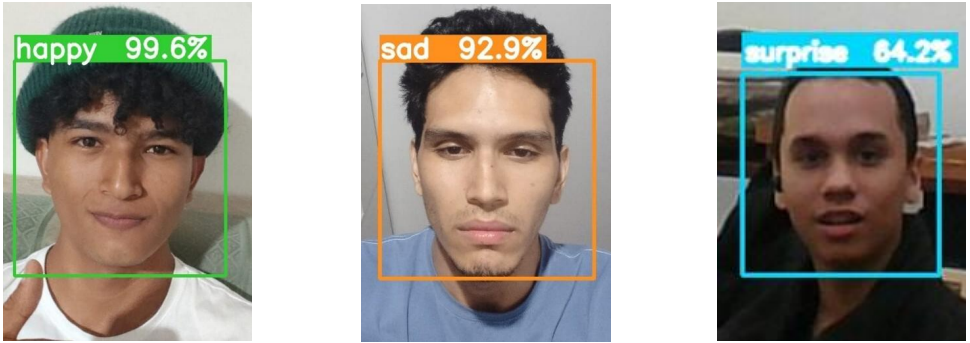
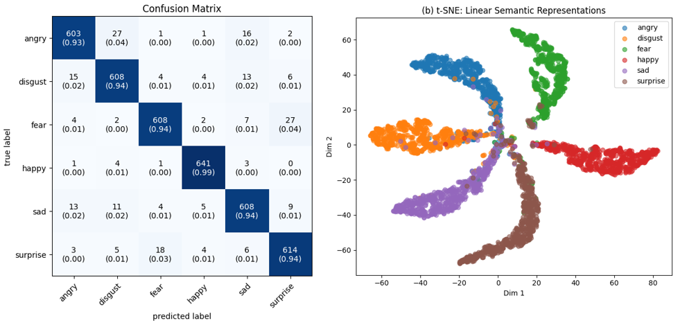

# Facial Emotion Recognition using Residual Networks and Angular Margin Based Discriminative Learning

<div align="center">

[](https://www.python.org/)
[](https://pytorch.org/)
[](LICENSE)
[](https://colab.research.google.com/github/ILuuI/facial-emotion-recognition-resnet-arcface/blob/main/FER_ResNet_ArcFace.ipynb)

**Universidad de Sucre · Sincelejo-Sucre, Colombia**

[Paper](#citation) · [Architecture](#architecture) · [Results](#results) 

</div>

---

## Overview

Official Pytorch Implementation of the paper, "Facial Emotion Recognition using Residual Networks and Angular Margin Based Discriminative Learning"（https://arxiv.org/pdf/xxxx)

> **Facial Emotion Recognition using Residual Networks and Angular Margin Based Discriminative Learning**
> Jose Carlos Arroyo Cantero, Lucas Mateo Rivadeneira Zarza, Enoc David Samur Martinez, Wilson de Jesús Arrubla Hoyos
> *INGE CUC · Universidad de Sucre, Colombia*
> [Read the full paper](#) ← *(add URL when published)*

<p align="justify">
Deep learning has significantly advanced facial emotion recognition; however,
achieving robust performance across heterogeneous datasets remains a challenging
task due to variations in image quality, acquisition conditions, and class
distributions. This paper presents a deep residual architecture for facial
emotion recognition trained with <b>ArcFace Loss</b>, a metric learning approach
based on angular margins that enhances feature discrimination among emotion
categories. The proposed model is trained on a curated dataset of
<b>39,000 facial images</b> collected from <b>33 heterogeneous sources</b>,
including standardized public benchmarks, real-world photographs,
AI-generated images, and manually labeled subsets balanced across all six
universal emotions. Extensive experiments show that the proposed model achieves
robust and reliable performance, reaching <b>94.41% accuracy</b> and a
<b>macro F1-score of 0.9441</b> on a held-out test set of
<b>3,900 images</b>.
</p>

<p align="center">
  
</p>
---

## Emotions Classified

<table align="center">
  <tr>
    <th>Class</th>
    <th>0</th>
    <th>1</th>
    <th>2</th>
    <th>3</th>
    <th>4</th>
    <th>5</th>
  </tr>
  <tr align="center">
    <td><b>Emotion</b></td>
    <td>Angry</td>
    <td>Disgust</td>
    <td>Fear</td>
    <td>Happy</td>
    <td>Sad</td>
    <td>Surprise</td>
  </tr>
</table>


---

## Architecture

The model is built on a custom **Residual Network (ResNet)** with the following design choices:

- **Residual blocks** with 3×3 convolutions; channels scale progressively from 32 → 256 → 128
- **Activation functions**: ReLU and SiLU for modeling nonlinear relationships
- **Spatial downsampling** via convolutions with stride 2 (128×128 → 8×8)
- **Classification head**: Multilayer Perceptron (MLP) over extracted embeddings
- **Loss function**: ArcFace Loss with angular margin `m` for intra-class compactness and inter-class separation

<p align="center">
  
</p>
---

### ArcFace Implementation

ArcFace loss is defined as:

$$\mathcal{L} = -\log \frac{e^{s \cdot \cos(\theta_{y_i} + m)}}{e^{s \cdot \cos(\theta_{y_i} + m)} + \sum_{j=1,\, j \neq y_i}^{N} e^{s \cdot \cos(\theta_j)}}$$

The ArcFace loss implementation was initially based on the open-source
implementation by **ronghuaiyang**:

> Ronghuaiyang. *arcface-pytorch*.  
> https://github.com/ronghuaiyang/arcface-pytorch

Specifically, the original implementation of the `ArcMarginProduct`
module (`models/metrics.py`) served as the starting point for this work.


### Our Modifications

While the original implementation uses fixed values for the angular margin
(`m`) and feature scale (`s`) throughout training, we redesigned the
optimization strategy by introducing a **dynamic warm-up schedule** for both
parameters.

Instead of keeping the ArcFace hyperparameters constant, our implementation
gradually updates them during the first training epochs:

<table align="center">
  <tr>
    <th align="center">Parameter</th>
    <th align="center">Initial</th>
    <th align="center">Final</th>
  </tr>
  <tr>
    <td align="center">Margin (<code>m</code>)</td>
    <td align="center">0.10</td>
    <td align="center">0.30</td>
  </tr>
  <tr>
    <td align="center">Scale (<code>s</code>)</td>
    <td align="center">10</td>
    <td align="center">25</td>
  </tr>
</table>

This modification allows the network to begin training under a softer metric
learning objective before progressively enforcing stronger angular constraints.
As the embedding space becomes more structured, the angular margin and feature
scale increase simultaneously, improving optimization stability and producing
more discriminative representations.

---

## Results

### Overall Performance

<table align="center">
  <thead>
    <tr>
      <th>Metric</th>
      <th>Value</th>
    </tr>
  </thead>
  <tbody>
    <tr>
      <td><strong>Accuracy</strong></td>
      <td><strong>94.41%</strong></td>
    </tr>
    <tr>
      <td>Macro Precision</td>
      <td>0.9442</td>
    </tr>
    <tr>
      <td>Macro Recall</td>
      <td>0.9441</td>
    </tr>
    <tr>
      <td>Macro F1-Score</td>
      <td>0.9441</td>
    </tr>
  </tbody>
</table>

### Performance by Emotion Class

<table align="center">
  <thead>
    <tr>
      <th>Class</th>
      <th>Precision</th>
      <th>Recall</th>
      <th>F1-Score</th>
      <th>Support</th>
    </tr>
  </thead>
  <tbody>
    <tr>
      <td>Angry</td>
      <td>0.9437</td>
      <td>0.9277</td>
      <td>0.9356</td>
      <td>650</td>
    </tr>
    <tr>
      <td>Disgust</td>
      <td>0.9254</td>
      <td>0.9354</td>
      <td>0.9304</td>
      <td>650</td>
    </tr>
    <tr>
      <td>Fear</td>
      <td>0.9560</td>
      <td>0.9354</td>
      <td>0.9456</td>
      <td>650</td>
    </tr>
    <tr>
      <td><strong>Happy</strong></td>
      <td><strong>0.9756</strong></td>
      <td><strong>0.9862</strong></td>
      <td><strong>0.9809</strong></td>
      <td>650</td>
    </tr>
    <tr>
      <td>Sad</td>
      <td>0.9311</td>
      <td>0.9354</td>
      <td>0.9332</td>
      <td>650</td>
    </tr>
    <tr>
      <td>Surprise</td>
      <td>0.9331</td>
      <td>0.9446</td>
      <td>0.9388</td>
      <td>650</td>
    </tr>
  </tbody>
</table>

> The **Happy** class achieved the highest F1-score (0.9809), while **Disgust** and **Sad** presented the greatest classification challenge, likely due to partial overlap in their facial action units.

<p align="center">
  
</p>
---

## Repository Structure

## Repository Structure

```
facial-emotion-recognition-resnet-arcface/
│
├── README.md                  # Project documentation
├── LICENSE
├── requirements.txt
├── notebook.ipynb             # End-to-end implementation
├── pictures/                  # Figures used in this README
└── checkpoints/               # Pretrained weights
```

---

### 5. Run in Google Colab

Open the training notebook directly:

[](https://colab.research.google.com/)

---

## Training Configuration

<table align="center">
  <thead>
    <tr>
      <th>Hyperparameter</th>
      <th>Value</th>
    </tr>
  </thead>
  <tbody>
    <tr>
      <td>Optimizer</td>
      <td>SGD (momentum=0.9, Nesterov)</td>
    </tr>
    <tr>
      <td>Weight Decay</td>
      <td>1×10⁻⁴</td>
    </tr>
    <tr>
      <td>Epochs</td>
      <td>101</td>
    </tr>
    <tr>
      <td>Batch Size</td>
      <td>160</td>
    </tr>
    <tr>
      <td>Max Learning Rate</td>
      <td>0.05</td>
    </tr>
    <tr>
      <td>LR Scheduler</td>
      <td>OneCycleLR (cosine)</td>
    </tr>
    <tr>
      <td>Mixed Precision</td>
      <td>FP16</td>
    </tr>
    <tr>
      <td>Global Seed</td>
      <td>20000807</td>
    </tr>
    <tr>
      <td>Input Size</td>
      <td>128×128 (grayscale)</td>
    </tr>
    <tr>
      <td>ArcFace Margin <code>m</code></td>
      <td>Scheduled (warm-up)</td>
    </tr>
    <tr>
      <td>Label Smoothing <code>ε</code></td>
      <td>0.05 → 0.02 → 0</td>
    </tr>
    <tr>
      <td>Drop Path</td>
      <td>up to 0.05</td>
    </tr>
  </tbody>
</table>

---

## Authors

| Name | Institution | Email | ORCID |
|------|-------------|-------|-------|
| Jose Carlos Arroyo Cantero | Universidad de Sucre | jose.arroyo54@unisucrevirtual.edu.co | [0009-0009-9449-8105](https://orcid.org/0009-0009-9449-8105) |
| Lucas Mateo Rivadeneira Zarza | Universidad de Sucre | lucas.rivadeneira@unisucrevirtual.edu.co | [0009-0004-7201-2905](https://orcid.org/0009-0004-7201-2905) |
| Enoc David Samur Martinez | Universidad de Sucre | enoc.samur@unisucrevirtual.edu.co | [0009-0002-7579-4944](https://orcid.org/0009-0002-7579-4944) |
| Wilson de Jesús Arrubla Hoyos | Universidad de Sucre | wilson.arrubla@unisucrevirtual.edu.co | [0000-0001-7119-7603](https://orcid.org/0000-0001-7119-7603) |

### Credits

| Contributor | Roles |
|-------------|-------|
| **Jose C. Arroyo** | Data Curation · Investigation · Methodology · Project Administration · Software · Visualization · Validation · Writing – Original Draft · Writing – Review & Editing |
| **Lucas M. Rivadeneira** | Data Curation · Investigation · Methodology · Software · Visualization · Writing – Original Draft · Writing – Review & Editing |
| **Enoc D. Samur** | Data Curation · Investigation · Methodology · Software · Visualization · Writing – Original Draft · Writing – Review & Editing |
| **Wilson J. Arrubla** | Supervision |

---

## Citation

If you use this work in your research, please cite:

```bibtex
@article{arroyo2026fer,
  title     = {Facial Emotion Recognition using Residual Networks and Angular Margin Based Discriminative Learning},
  author    = {Arroyo Cantero, Jose Carlos and Rivadeneira Zarza, Lucas Mateo and Samur Martinez, Enoc David and Arrubla Hoyos, Wilson de Jes{\'u}s},
  journal   = {INGE CUC},
  year      = {2026},
  publisher = {Universidad de Sucre},
  url       = {}
}
```

---

## License

This project is licensed under the **MIT License** — see the [LICENSE](LICENSE) file for details.

---

## References

Key references from the paper:

- Ekman, P. — Universal basic emotions and facial action coding (FACS)
- ArcFace: Additive Angular Margin Loss for Deep Face Recognition (Deng et al., 2019)
- ResNet: Deep Residual Learning for Image Recognition (He et al., 2016)
- PyTorch: An Imperative Style, High-Performance Deep Learning Library
- AffectNet: A Database for Facial Expression, Valence, and Arousal in the Wild

---

<div align="center">
Made with ❤️ by <strong>PEPA PIC Research Group</strong> · Universidad de Sucre · Sincelejo, Colombia
</div>
